<div align="center">

# 🌐 Protocol Virtual Machine (PVM)

### A Cross-Platform Adaptive Networking Runtime for VESPER OS

[](#)
[](#cross-platform-support)
[](#license)
[](#)

**The world's first protocol-level virtual machine — swap, compose, and script network protocols at runtime.**

*Created by **Daniel Kimeu***

</div>

---

## 📋 Table of Contents

- [Overview](#-overview)
- [Architecture](#-architecture)
- [Feature Map](#-feature-map)
- [Quick Start](#-quick-start)
- [Core Concepts](#-core-concepts)
  - [Dynamic Protocol Modules](#1-dynamic-protocol-modules)
  - [Adaptive Protocol Scheduler](#2-adaptive-protocol-scheduler)
  - [Composable Network Stack](#3-composable-network-stack-pipeline)
  - [Protocol Bytecode VM](#4-protocol-bytecode-vm)
  - [Network Simulation Engine](#5-network-simulation-engine)
  - [Cross-Device Protocol Negotiation](#6-cross-device-protocol-negotiation)
- [Evolution Paths](#-evolution-paths)
  - [Network Kernel Mode](#7-network-kernel-mode-socket-api)
  - [Protocol DSL](#8-protocol-dsl)
  - [Distributed PVM Mesh](#9-distributed-pvm-mesh)
- [Wire Formats](#-wire-formats)
- [API Reference](#-api-reference)
- [Project Structure](#-project-structure)
- [Cross-Platform Support](#-cross-platform-support)
- [Demo Output](#-demo-output)
- [Roadmap](#-roadmap)
- [Author](#-author)

---

## 🔭 Overview

The **Protocol Virtual Machine (PVM)** is a revolutionary networking runtime where network protocols are not hardcoded — they're **hot-swappable plugins**, **composable middleware stacks**, and even **portable bytecode scripts**. Built for the [VESPER OS](https://github.com/dnlkilonzi-pixel) project, the PVM reimagines how applications interact with the network.

```c
pvm_init();
pvm_load("udp");                       // Load UDP as a plugin
pvm_load("vesper_lite");               // Load custom protocol
pvm_switch("vesper_lite");             // Hot-swap at runtime
pvm_connect("192.168.1.10", 9001);
pvm_send(data, len);                   // Transparent to the app
pvm_receive(buf, sizeof(buf));
pvm_shutdown();
```

### What Makes PVM Different

| Traditional Networking | Protocol Virtual Machine |
|------------------------|--------------------------|
| Protocols hardcoded in kernel | Protocols are hot-swappable plugins |
| One protocol per connection | Switch protocols mid-session |
| Static network stack | Composable middleware layers |
| Manual protocol implementation | Define protocols in DSL, compile to bytecode |
| No built-in testing | Chaos testing engine with simulated impairments |
| Single-node decisions | Distributed mesh consensus for protocol selection |

---

## 🏗 Architecture

### High-Level System Architecture

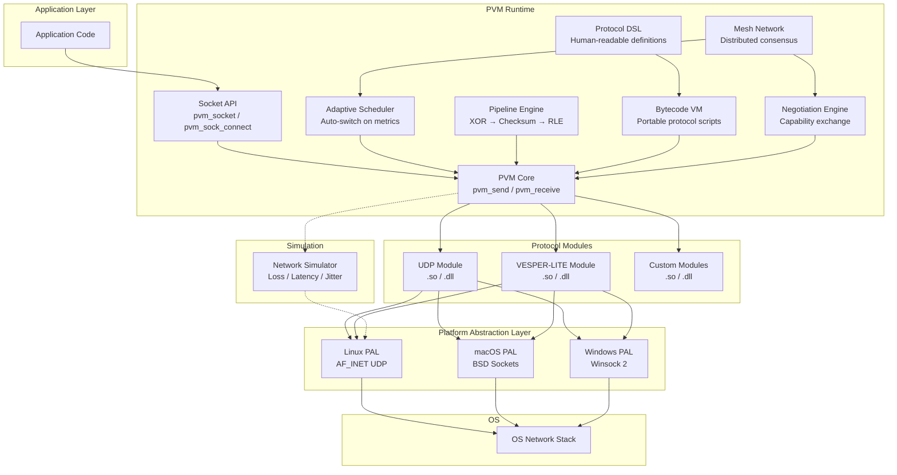

### Data Flow — Send Path

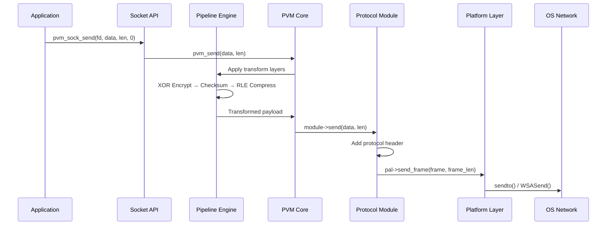

### Data Flow — Receive Path

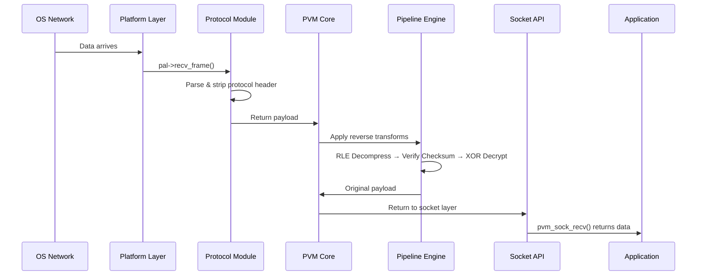

---

## 🗺 Feature Map

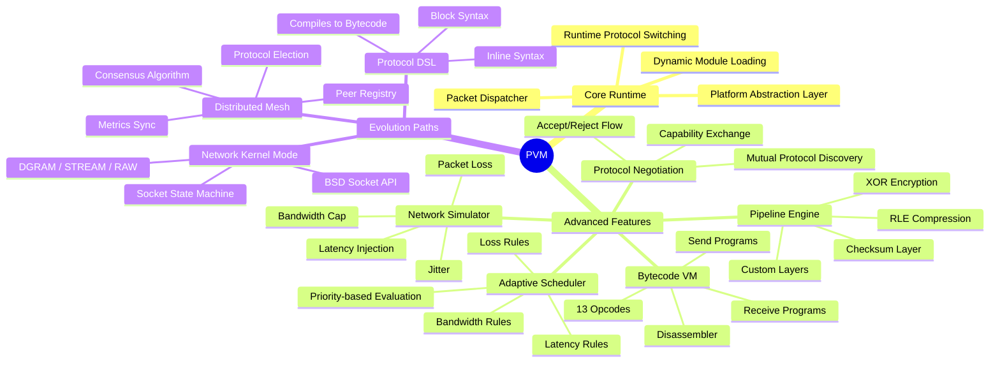

---

## 🚀 Quick Start

### Prerequisites

- **GCC** (C99 compatible)
- **GNU Make**
- Linux, macOS, or Windows (with MinGW)

### Build & Run

```bash
# Clone the repository
git clone https://github.com/dnlkilonzi-pixel/Protocol-Virtual-Machine.git
cd Protocol-Virtual-Machine/pvm

# Build everything (auto-detects OS)
make all

# Run the full demo (13 feature demonstrations)
make test

# Clean build artifacts
make clean
```

### Expected Build Output

```
gcc ... -shared -fPIC -o modules/udp/udp.so modules/udp/udp_module.c
  Built modules/udp/udp.so
gcc ... -shared -fPIC -o modules/vesper_lite/vesper_lite.so modules/vesper_lite/vesper_lite_module.c
  Built modules/vesper_lite/vesper_lite.so
gcc ... -o pvm_demo main.c core/pvm.c core/scheduler.c core/pipeline.c ...
  Built pvm_demo
```

---

## 🧠 Core Concepts

### 1. Dynamic Protocol Modules

Network protocols are loaded as **shared libraries** at runtime — no recompilation needed.

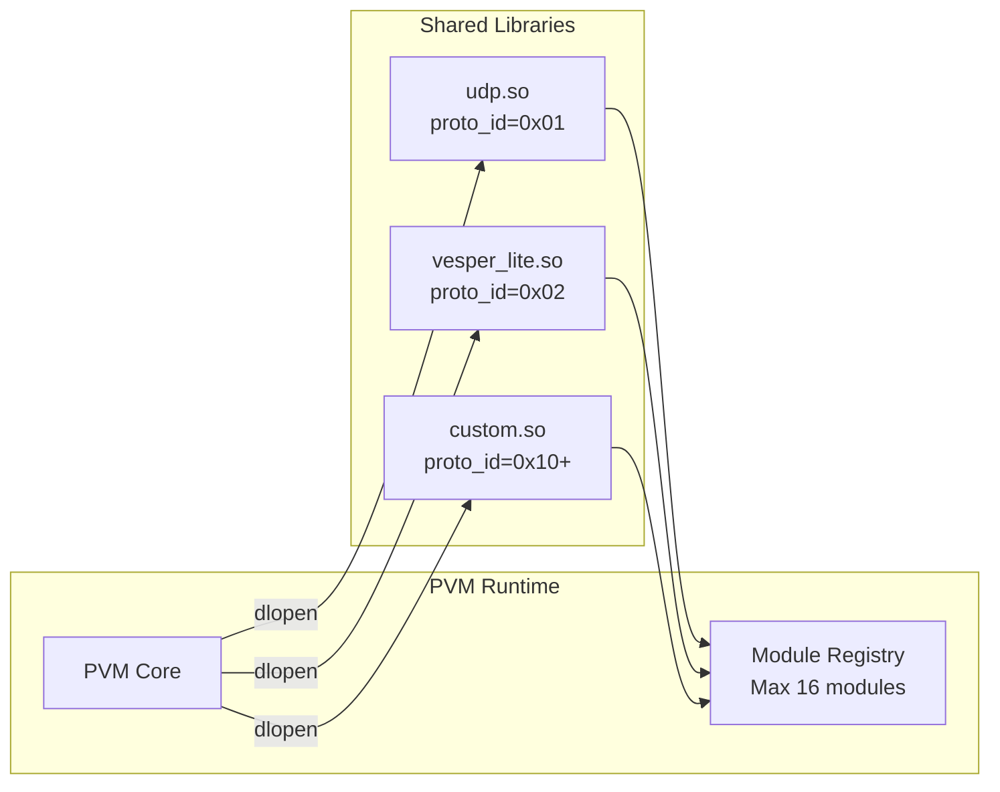

**Every module implements a standard vtable:**

```c
typedef struct {
    const char *name;                              // "udp", "vesper_lite"
    const char *version;                           // "1.0"
    int  (*init)(const PlatformOps *ops);           // Receive PAL vtable
    int  (*connect)(const char *addr, uint16_t port);
    int  (*send)(const uint8_t *data, size_t len);
    int  (*receive)(uint8_t *buffer, size_t max_len);
    void (*close)(void);
    void (*destroy)(void);
} ProtocolModule;
```

**Usage:**

```c
pvm_init();
pvm_load("udp");                    // Loads ./modules/udp/udp.so
pvm_load("vesper_lite");            // Loads ./modules/vesper_lite/vesper_lite.so
pvm_switch("vesper_lite");          // Activate VESPER-LITE
pvm_connect("127.0.0.1", 9001);
pvm_send(data, len);
pvm_switch("udp");                  // Hot-swap to UDP mid-session!
pvm_send(data, len);                // Now using UDP
```

---

### 2. Adaptive Protocol Scheduler

The scheduler **automatically switches protocols** based on real-time network conditions.

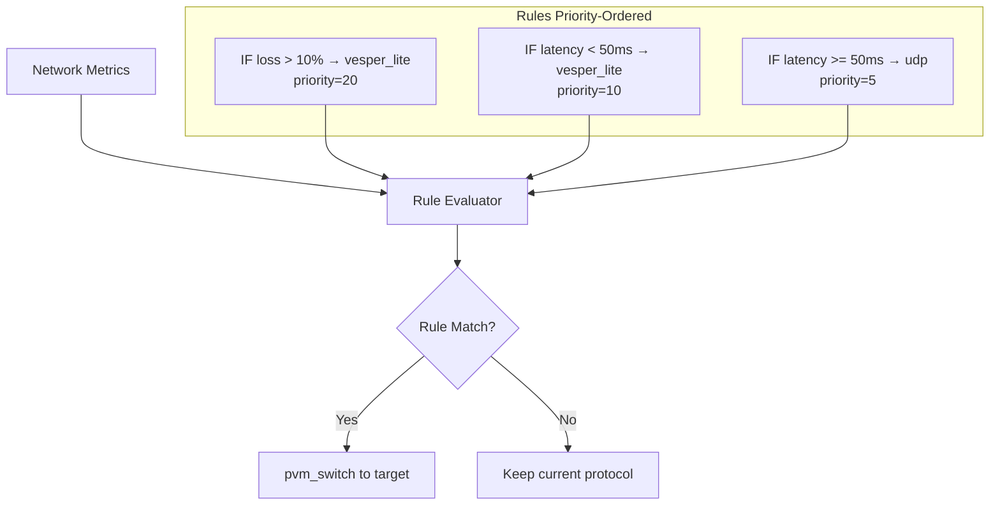

**Example:**

```c
pvm_scheduler_init();

// High packet loss → switch to reliable protocol
pvm_scheduler_add_rule(SCHED_METRIC_LOSS_PCT, SCHED_CMP_GREATER,
                       10, "vesper_lite", /*priority=*/20);

// Low latency → use faster protocol
pvm_scheduler_add_rule(SCHED_METRIC_LATENCY_MS, SCHED_CMP_LESS,
                       50, "vesper_lite", /*priority=*/10);

// Update live metrics
pvm_scheduler_update_metric(SCHED_METRIC_LATENCY_MS, 120);
pvm_scheduler_update_metric(SCHED_METRIC_LOSS_PCT, 15);

// Evaluate — automatically switches protocol!
SchedResult result;
pvm_scheduler_evaluate(&result);
// result.switched = 1, result.to_proto = "vesper_lite"
```

**Supported Metrics:** Latency (ms), Packet Loss (%), Bandwidth (Kbps), Jitter (ms), 2× Custom

---

### 3. Composable Network Stack (Pipeline)

Build custom network stacks by **composing transformation layers** — like middleware for packets.

```mermaid
graph TB
    subgraph Send Path Top → Bottom
        direction TB
        APP_S[Application Data] --> XOR_S[XOR Encrypt<br/>key=0x42]
        XOR_S --> CHK_S[Checksum<br/>Append 1-byte XOR]
        CHK_S --> RLE_S[RLE Compress<br/>Run-length encoding]
        RLE_S --> TX[pvm_send → Transport]
    end

    subgraph Receive Path Bottom → Top
        direction TB
        RX[Transport → pvm_receive] --> RLE_R[RLE Decompress]
        RLE_R --> CHK_R[Checksum Verify]
        CHK_R --> XOR_R[XOR Decrypt]
        XOR_R --> APP_R[Application Data]
    end
```

**Built-in Layers:**

| Layer | Send Transform | Receive Transform |
|-------|---------------|-------------------|
| `xor_encrypt` | XOR each byte with `0x42` | XOR each byte with `0x42` (symmetric) |
| `rle_compress` | Run-length encode | Run-length decode |
| `checksum` | Append 1-byte XOR checksum | Verify & strip checksum |

**Example:**

```c
pvm_pipeline_init();
pvm_pipeline_push("xor_encrypt");    // Layer 0: encryption
pvm_pipeline_push("checksum");       // Layer 1: integrity
pvm_pipeline_push("rle_compress");   // Layer 2: compression

// Send: encrypt → checksum → compress → transport
pvm_pipeline_send(data, len);

// Receive: transport → decompress → verify → decrypt
pvm_pipeline_receive(buf, sizeof(buf));

// Add custom layers too!
PipelineLayer my_layer = {
    .name = "my_transform",
    .transform_send = my_send_fn,
    .transform_recv = my_recv_fn,
};
pvm_pipeline_push_custom(&my_layer);
```

---

### 4. Protocol Bytecode VM

Define protocols as **portable bytecode scripts** instead of compiled C modules — this is **"WebAssembly for Networking"**.

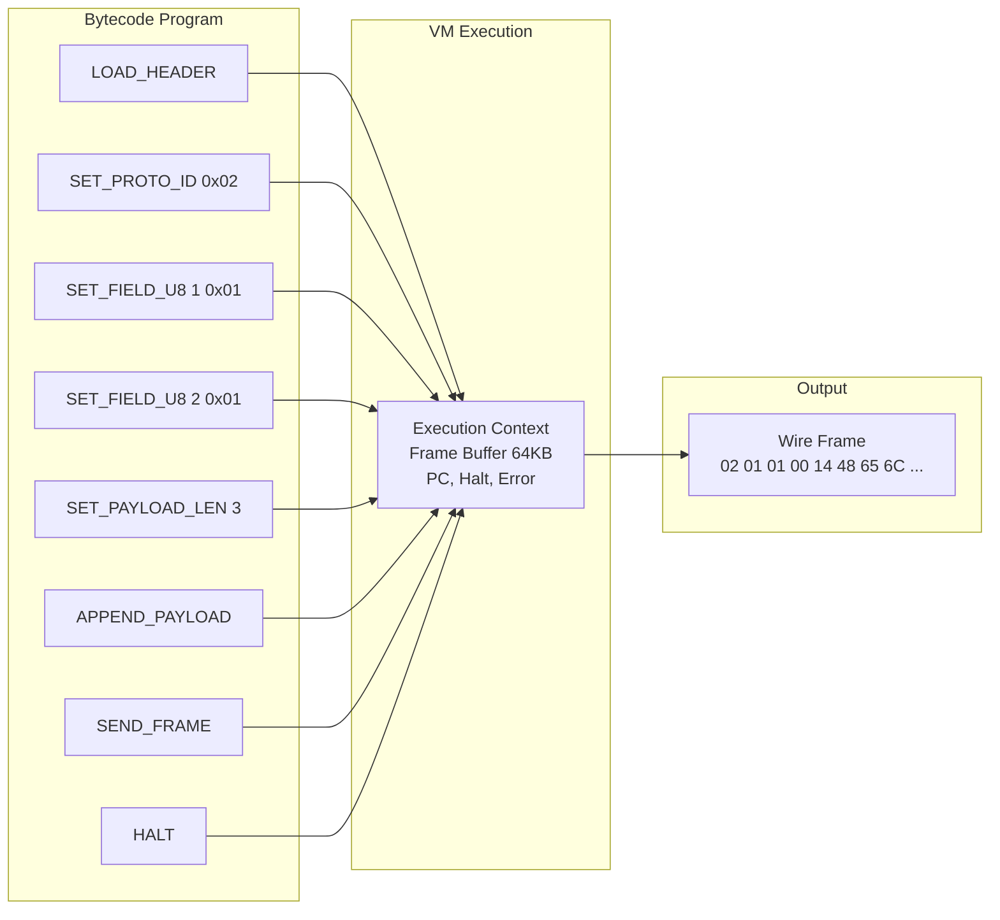

**13 Opcodes:**

| Opcode | Hex | Description |
|--------|-----|-------------|
| `OP_NOP` | `0x00` | No operation |
| `OP_LOAD_HEADER` | `0x01` | Reset frame buffer |
| `OP_SET_PROTO_ID` | `0x02` | Set protocol identifier byte |
| `OP_SET_FIELD_U8` | `0x03` | Set 1-byte field at offset |
| `OP_SET_FIELD_U16` | `0x04` | Set 2-byte big-endian field |
| `OP_APPEND_PAYLOAD` | `0x05` | Append user payload to frame |
| `OP_SEND_FRAME` | `0x06` | Transmit assembled frame |
| `OP_RECV_FRAME` | `0x07` | Receive frame from network |
| `OP_CHECK_FIELD_U8` | `0x08` | Verify byte at offset matches |
| `OP_EXTRACT_PAYLOAD` | `0x09` | Copy payload region to output |
| `OP_SET_PAYLOAD_LEN` | `0x0A` | Write payload length (BE16) |
| `OP_PRINT_FRAME` | `0x0B` | Debug: hex dump frame |
| `OP_HALT` | `0xFF` | End program execution |

**Example — VESPER-LITE as Bytecode:**

```c
PvmBytecodeProgram prog;
pvm_bc_program_init(&prog, "vesper_bc_send");

pvm_bc_emit(&prog, OP_LOAD_HEADER,     0, 0);
pvm_bc_emit(&prog, OP_SET_PROTO_ID,    0x02, 0);     // VESPER-LITE
pvm_bc_emit(&prog, OP_SET_FIELD_U8,    1, 0x01);     // version=1
pvm_bc_emit(&prog, OP_SET_FIELD_U8,    2, 0x01);     // type=DATA
pvm_bc_emit(&prog, OP_SET_PAYLOAD_LEN, 3, 0);        // length at offset 3-4
pvm_bc_emit(&prog, OP_APPEND_PAYLOAD,  0, 0);
pvm_bc_emit(&prog, OP_SEND_FRAME,      0, 0);
pvm_bc_emit(&prog, OP_HALT,            0, 0);

// Execute — no .so module needed!
pvm_bc_execute(&prog, payload, payload_len, &ctx);
```

---

### 5. Network Simulation Engine

Test your protocols **without touching real networks** — a built-in chaos testing engine.

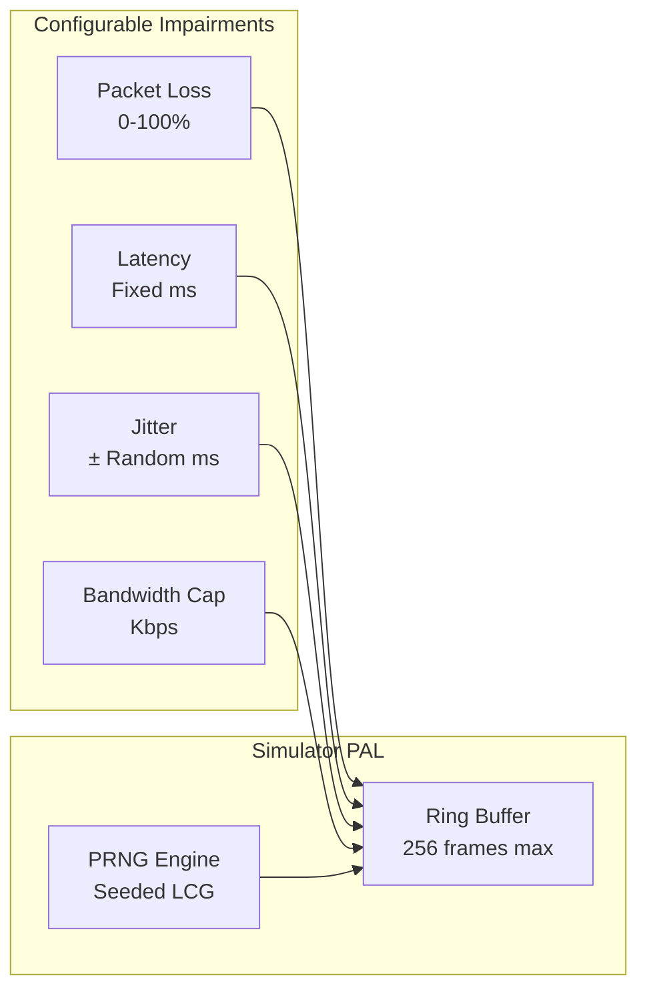

**Example:**

```c
SimConfig cfg = {
    .loss_pct      = 20,      // 20% packet loss
    .latency_ms    = 50,      // 50ms base latency
    .jitter_ms     = 10,      // ±10ms jitter
    .bandwidth_kbps = 1000,   // 1 Mbps cap
    .seed          = 42,      // Reproducible results
};

pvm_sim_configure(&cfg);
pvm_sim_enable();              // Replace real PAL with simulator

// All PVM traffic now goes through simulated network
for (int i = 0; i < 100; i++)
    pvm_send(data, len);

SimStats stats;
pvm_sim_get_stats(&stats);
printf("Sent: %lu  Received: %lu  Dropped: %lu\n",
       stats.frames_sent, stats.frames_received, stats.frames_dropped);

pvm_sim_disable();             // Restore real network
```

---

### 6. Cross-Device Protocol Negotiation

Two PVM devices can **automatically discover** which protocols they both support and **agree on the best one**.

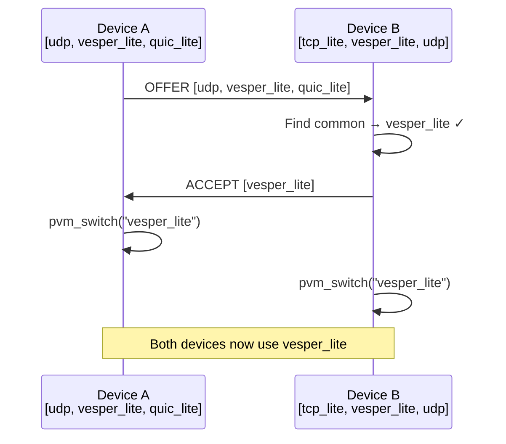

**Wire Format (proto_id = `0xFE`):**

```
[0xFE] [msg_type: OFFER|ACCEPT|REJECT] [count] [name₁(32B)] [name₂(32B)] ...
```

**Example:**

```c
pvm_nego_init();

// Build local capabilities from loaded modules
NegoCapabilities local;
pvm_nego_get_local_caps(&local);

// Find mutual protocol with remote device
NegoCapabilities remote = { .names = {"tcp_lite", "vesper_lite"}, .count = 2 };
char agreed[32];
if (pvm_nego_find_common(&local, &remote, agreed) == 0)
    printf("Agreed on: %s\n", agreed);  // "vesper_lite"
```

---

## 🔮 Evolution Paths

### 7. Network Kernel Mode (Socket API)

PVM becomes a **drop-in replacement for OS sockets** — applications use familiar BSD socket semantics but all traffic flows through the PVM engine.

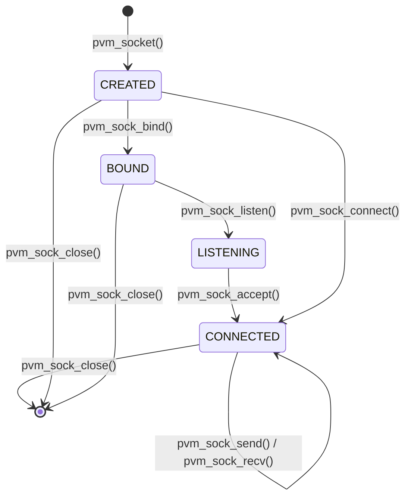

**Socket Types:**

| Type | Constant | Description |
|------|----------|-------------|
| Datagram | `PVM_SOCK_DGRAM` | Connectionless (UDP-like) |
| Stream | `PVM_SOCK_STREAM` | Connection-oriented (TCP-like) |
| Raw | `PVM_SOCK_RAW` | Raw PVM frames (no protocol framing) |

**Example — Looks just like BSD sockets:**

```c
// Create a UDP-style socket using the VESPER-LITE protocol
int fd = pvm_socket(PVM_SOCK_DGRAM, "vesper_lite");
pvm_sock_connect(fd, "192.168.1.10", 8080);
pvm_sock_send(fd, data, len, 0);

int n = pvm_sock_recv(fd, buf, sizeof(buf), 0);
pvm_sock_close(fd);
```

**The application never knows PVM exists — it thinks it's using regular sockets.**

---

### 8. Protocol DSL

Define protocols in a **human-readable language** that compiles to bytecode VM programs — no C code needed.

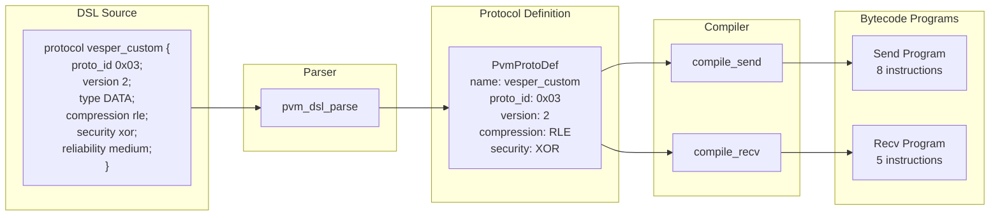

**Two Formats Supported:**

<table>
<tr><th>Block Format</th><th>Inline Format</th></tr>
<tr><td>

```
protocol vesper_custom {
    proto_id    0x03;
    version     2;
    type        DATA;
    compression rle;
    security    xor;
    reliability medium;
}
```

</td><td>

```
fast_udp: proto_id=0x05 version=1 type=DATA compression=none security=none reliability=low
```

</td></tr>
</table>

**DSL Properties:**

| Property | Values | Description |
|----------|--------|-------------|
| `proto_id` | `0x00`–`0xFF` | Wire protocol identifier |
| `version` | Integer | Protocol version byte |
| `type` | `DATA`, `CTRL`, `ACK` | Default message type |
| `compression` | `none`, `rle` | Compression mode |
| `security` | `none`, `xor` | Security transform |
| `reliability` | `none`, `low`, `medium`, `high` | Reliability level |

**Example:**

```c
pvm_dsl_init();

const char *source =
    "protocol vesper_custom {\n"
    "    proto_id    0x03;\n"
    "    version     2;\n"
    "    type        DATA;\n"
    "    compression rle;\n"
    "    security    xor;\n"
    "    reliability medium;\n"
    "}";

PvmProtoDef def;
pvm_dsl_parse(source, &def);           // Parse DSL
pvm_dsl_print_def(&def);               // Print parsed definition

PvmBytecodeProgram send_prog;
pvm_dsl_compile_send(&def, &send_prog); // Compile to bytecode

// Execute the auto-generated program!
pvm_bc_execute(&send_prog, payload, len, NULL);
```

---

### 9. Distributed PVM Mesh

Multiple PVM nodes form a **self-adapting distributed system** — sharing state, capabilities, and running consensus elections.

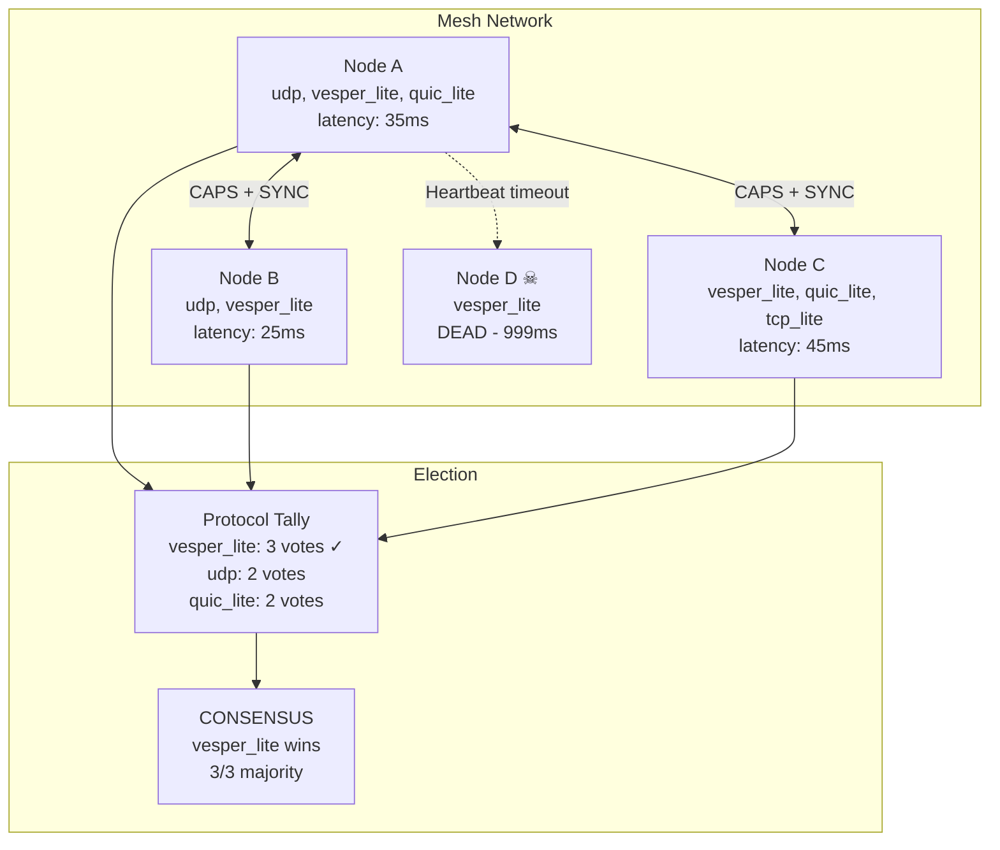

**Message Types:**

| Type | Code | Description |
|------|------|-------------|
| `MESH_MSG_HEARTBEAT` | `0x01` | Node alive + metrics |
| `MESH_MSG_CAPS` | `0x02` | Protocol capabilities broadcast |
| `MESH_MSG_SYNC` | `0x03` | Scheduler state synchronization |
| `MESH_MSG_ELECT` | `0x04` | Protocol election proposal |
| `MESH_MSG_AGREE` | `0x05` | Agreement to proposed protocol |

**Election Algorithm:**
1. Count alive peers and their supported protocols
2. Tally votes for each protocol across all nodes
3. If the top protocol has > 50% support → **consensus reached**
4. All nodes call `pvm_switch()` to the elected protocol

**Example:**

```c
pvm_mesh_init("node-A");
pvm_mesh_add_peer("node-B", "192.168.1.2", 9001);
pvm_mesh_add_peer("node-C", "192.168.1.3", 9001);

// Set peer capabilities and state
pvm_mesh_set_peer_protocols("node-B", protos_b, 2);
pvm_mesh_set_peer_state("node-B", MESH_NODE_ALIVE, 25, 0);

// Broadcast our capabilities
pvm_mesh_broadcast_caps();

// Sync scheduler metrics across the mesh
pvm_mesh_sync_metrics();

// Run consensus election
MeshElectionResult election;
pvm_mesh_elect_protocol(&election);
if (election.success)
    printf("Consensus: %s (%d/%d)\n",
           election.protocol, election.supporters, election.total_nodes);
```

---

## 📦 Wire Formats

### PVM Frame (Outer Envelope)

Every frame on the wire starts with a 1-byte protocol identifier:

```
┌─────────────┬──────────────────────────┐
│  proto_id   │    Protocol Payload      │
│   (1 byte)  │     (variable)           │
└─────────────┴──────────────────────────┘
```

| proto_id | Protocol |
|----------|----------|
| `0x01` | UDP |
| `0x02` | VESPER-LITE |
| `0xFD` | Mesh Control |
| `0xFE` | Negotiation Control |
| `0x10`+ | Custom modules |

### VESPER-LITE Frame (Inner Protocol)

```
┌─────────┬──────────┬──────────┬───────────┬──────────────┐
│ proto_id│ version  │  type    │ length    │  payload     │
│ (1 B)   │ (1 B)    │ (1 B)   │ (2 B BE)  │ (variable)   │
│ 0x02    │ 0x01     │ DATA    │ N         │ N bytes      │
└─────────┴──────────┴──────────┴───────────┴──────────────┘
```

| Offset | Size | Field | Values |
|--------|------|-------|--------|
| 0 | 1 B | proto_id | `0x02` (VESPER-LITE) |
| 1 | 1 B | version | `0x01` |
| 2 | 1 B | type | `0x01`=DATA, `0x02`=CTRL, `0x03`=ACK, `0xFF`=ERR |
| 3–4 | 2 B | length | Big-endian uint16 payload byte count |
| 5+ | var | payload | User data |

### Negotiation Wire Format

```
┌─────────┬──────────┬───────┬───────────────┬───────────────┐
│ 0xFE    │ msg_type │ count │ name₁ (32 B)  │ name₂ (32 B)  │ ...
└─────────┴──────────┴───────┴───────────────┴───────────────┘
```

### Mesh Wire Format

```
┌─────────┬──────────┬────────────────┬──────────────────┐
│ 0xFD    │ msg_type │ node_id (16 B) │ payload ...      │
└─────────┴──────────┴────────────────┴──────────────────┘
```

---

## 📚 API Reference

### Core API (`pvm.h`)

| Function | Description |
|----------|-------------|
| `pvm_init()` | Initialize the PVM runtime |
| `pvm_shutdown()` | Tear down and release all resources |
| `pvm_load(name)` | Load a protocol module by name |
| `pvm_unload(name)` | Unload a protocol module |
| `pvm_list_modules()` | Print all loaded modules |
| `pvm_switch(name)` | Set the active protocol |
| `pvm_connect(addr, port)` | Connect active protocol to endpoint |
| `pvm_send(data, len)` | Send data via active protocol |
| `pvm_receive(buf, max_len)` | Receive data via active protocol |

### Socket API (`pvm_socket.h`)

| Function | Description |
|----------|-------------|
| `pvm_socket(type, protocol)` | Create a PVM socket (returns fd) |
| `pvm_sock_bind(fd, addr, port)` | Bind to local address |
| `pvm_sock_listen(fd, backlog)` | Mark as listening |
| `pvm_sock_accept(fd, remote)` | Accept incoming connection |
| `pvm_sock_connect(fd, addr, port)` | Connect to remote endpoint |
| `pvm_sock_send(fd, data, len, flags)` | Send data |
| `pvm_sock_recv(fd, buf, max_len, flags)` | Receive data |
| `pvm_sock_close(fd)` | Close socket |

### Scheduler API (`scheduler.h`)

| Function | Description |
|----------|-------------|
| `pvm_scheduler_init()` | Initialize scheduler engine |
| `pvm_scheduler_add_rule(metric, cmp, threshold, target, priority)` | Register a rule |
| `pvm_scheduler_update_metric(metric, value)` | Supply metric value |
| `pvm_scheduler_evaluate(result)` | Evaluate rules and auto-switch |

### Pipeline API (`pipeline.h`)

| Function | Description |
|----------|-------------|
| `pvm_pipeline_init()` | Initialize pipeline |
| `pvm_pipeline_push(name)` | Add a built-in layer |
| `pvm_pipeline_push_custom(layer)` | Add a custom layer |
| `pvm_pipeline_send(data, len)` | Send through layer stack |
| `pvm_pipeline_receive(buf, max_len)` | Receive and unwind layers |

### Bytecode VM API (`bytecode.h`)

| Function | Description |
|----------|-------------|
| `pvm_bc_program_init(prog, name)` | Initialize empty program |
| `pvm_bc_emit(prog, opcode, arg1, arg2)` | Append instruction |
| `pvm_bc_execute(prog, payload, len, ctx)` | Execute send program |
| `pvm_bc_execute_recv(prog, buf, max_len, ctx)` | Execute receive program |
| `pvm_bc_disassemble(prog)` | Print disassembly |

### DSL API (`proto_dsl.h`)

| Function | Description |
|----------|-------------|
| `pvm_dsl_parse(source, def)` | Parse DSL into protocol definition |
| `pvm_dsl_compile_send(def, prog)` | Compile to send bytecode |
| `pvm_dsl_compile_recv(def, prog)` | Compile to receive bytecode |

### Mesh API (`mesh.h`)

| Function | Description |
|----------|-------------|
| `pvm_mesh_init(node_id)` | Initialize mesh for this node |
| `pvm_mesh_add_peer(id, addr, port)` | Register remote peer |
| `pvm_mesh_broadcast_caps()` | Broadcast capabilities |
| `pvm_mesh_sync_metrics()` | Synchronize scheduler metrics |
| `pvm_mesh_elect_protocol(result)` | Run consensus election |

### Simulator API (`simulator.h`)

| Function | Description |
|----------|-------------|
| `pvm_sim_configure(cfg)` | Set impairment parameters |
| `pvm_sim_enable()` | Replace real PAL with simulator |
| `pvm_sim_disable()` | Restore real PAL |
| `pvm_sim_get_stats(out)` | Retrieve simulation statistics |

---

## 📁 Project Structure

```
Protocol-Virtual-Machine/
│
├── README.md                                   # This file
│
└── pvm/                                        # PVM source tree
    ├── Makefile                                # Auto-detect OS; build modules + binary
    ├── main.c                                  # CLI demo (13 demonstrations, 886 LOC)
    │
    ├── include/                                # 14 public API headers
    │   ├── pvm.h                               # Core PVM API
    │   ├── protocol.h                          # Protocol module vtable interface
    │   ├── packet.h                            # Packet containers & wire formats
    │   ├── dispatcher.h                        # Packet demultiplexer
    │   ├── bytecode.h                          # Bytecode VM (13 opcodes)
    │   ├── pipeline.h                          # Composable layer pipeline
    │   ├── scheduler.h                         # Adaptive protocol scheduler
    │   ├── proto_dsl.h                         # Protocol DSL parser/compiler
    │   ├── pvm_socket.h                        # POSIX-like socket API
    │   ├── negotiation.h                       # Cross-device capability exchange
    │   ├── mesh.h                              # Distributed mesh network
    │   ├── platform.h                          # Platform Abstraction Layer interface
    │   ├── module_loader.h                     # Dynamic library loading
    │   └── simulator.h                         # Network simulation mode
    │
    ├── core/                                   # Core runtime (6 files, ~1,880 LOC)
    │   ├── pvm.c                               # PVM runtime engine
    │   ├── scheduler.c                         # Adaptive scheduler
    │   ├── pipeline.c                          # Stackable layer pipeline
    │   ├── bytecode.c                          # Bytecode VM interpreter
    │   ├── proto_dsl.c                         # DSL parser & compiler
    │   └── pvm_socket.c                        # Network kernel socket API
    │
    ├── net/                                    # Networking layer (4 files, ~817 LOC)
    │   ├── dispatcher.c                        # Packet demultiplexer
    │   ├── packet.c                            # Frame builders & parsers
    │   ├── negotiation.c                       # Protocol negotiation engine
    │   └── mesh.c                              # Distributed mesh network
    │
    ├── platform/                               # Platform Abstraction Layer
    │   ├── module_loader.c                     # dlopen/LoadLibrary wrapper
    │   ├── linux/platform_linux.c              # Linux: AF_INET UDP
    │   ├── macos/platform_macos.c              # macOS: BSD sockets
    │   ├── windows/platform_windows.c          # Windows: Winsock 2
    │   └── sim/platform_sim.c                  # Network simulator (in-memory)
    │
    └── modules/                                # Protocol plugins (shared libraries)
        ├── udp/udp_module.c                    # UDP transport module
        └── vesper_lite/vesper_lite_module.c     # VESPER-LITE custom protocol
```

**Total: 6,600+ lines of C code across 25 files.**

---

## 💻 Cross-Platform Support

The PVM runs on all major operating systems through its Platform Abstraction Layer:

| Platform | PAL File | Build Flags | Module Extension |
|----------|----------|-------------|------------------|
| **Linux** | `platform/linux/platform_linux.c` | `-ldl -lpthread` | `.so` |
| **macOS** | `platform/macos/platform_macos.c` | `-ldl` | `.dylib` |
| **Windows** | `platform/windows/platform_windows.c` | `-lws2_32` | `.dll` |

**All OS-specific code is confined to `/platform`.** The PVM core, all protocol modules, and all feature engines contain **zero platform-specific headers** — enforced by design.

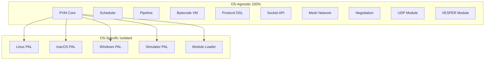

**Environment Variables (all platforms):**

| Variable | Default | Description |
|----------|---------|-------------|
| `PVM_REMOTE_HOST` | `127.0.0.1` | Destination IP address |
| `PVM_REMOTE_PORT` | `9001` | Destination port |
| `PVM_LOCAL_PORT` | `9001` | Local bind port |
| `PVM_MODULE_PATH` | `./modules` | Module search directory |

---

## 🖥 Demo Output

Running `make test` executes 13 demonstrations:

```
+--------------------------------------------------------------+
|          VESPER OS - Protocol Virtual Machine (PVM)           |
|         Cross-Platform Adaptive Networking Runtime            |
|                                                              |
|  Features:                                                   |
|    [1] Dynamic Protocol Modules (.so/.dll)                   |
|    [2] Adaptive Protocol Scheduler                           |
|    [3] Composable Network Stack (Pipeline)                   |
|    [4] Protocol Bytecode VM                                  |
|    [5] Network Simulation Engine                             |
|    [6] Cross-Device Protocol Negotiation                     |
|  Evolution Paths:                                            |
|    [7] Network Kernel Mode (Socket API)                      |
|    [8] Protocol DSL (Human-Readable Definitions)             |
|    [9] Distributed PVM Mesh                                  |
+--------------------------------------------------------------+
```

**Demo highlights:**

| Demo | Feature | What It Shows |
|------|---------|---------------|
| 1 | UDP Module | Load, connect, send, receive over loopback |
| 2 | VESPER-LITE | Custom protocol with 4-byte header |
| 3 | Protocol Switch | Hot-swap between UDP and VESPER-LITE |
| 4 | Dispatcher | Wire frame layout and demultiplexing |
| 5 | Scheduler | Auto-switch based on latency/loss metrics |
| 6 | Pipeline | XOR encrypt → Checksum → RLE compress stack |
| 7 | Bytecode VM | Define VESPER protocol entirely as bytecode |
| 8 | Simulator | 20% packet loss simulation (17/20 delivered) |
| 9 | Negotiation | Two devices agree on `vesper_lite` |
| 10 | Socket API | BSD socket interface over PVM |
| 11 | Protocol DSL | Human-readable definition → bytecode |
| 12 | Mesh Network | 4-node mesh with consensus election |

---

## 🗺 Roadmap

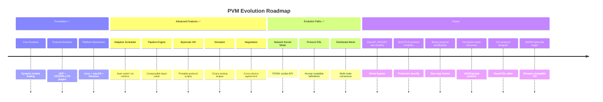

---

## 👨‍💻 Author

<div align="center">

### **Daniel Kimeu**

*Sole Creator & Architect*

The Protocol Virtual Machine is designed and built entirely by Daniel Kimeu as part of the **VESPER OS** project — a vision for next-generation adaptive networking infrastructure.

[](https://github.com/dnlkilonzi-pixel)

</div>

---

## 📄 License

This project is part of the VESPER OS ecosystem by Daniel Kimeu.

---

<div align="center">

**⭐ Star this repository if you believe networking should be programmable, not hardcoded. ⭐**

*Built with pure C99 • Zero dependencies • 6,600+ lines of cross-platform code*

</div>
